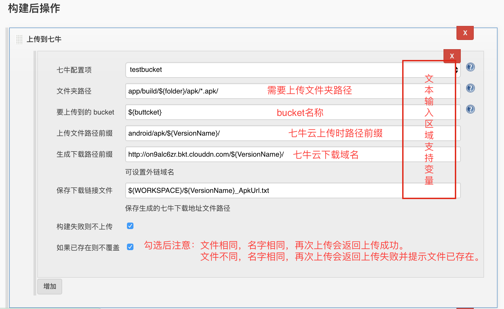

七牛云上传插件
===========

### 支持功能

* 文件路径前缀添加　　
* 生成文件下载链接


### 设置

1.系统管理－系统设置,添加七牛`AccessKey`和`SecertKey`。


2.在任务中添加`构建后操作`



如上图，文本输入区域内填写支持环境变量配置。　　
`生成下载路径前缀`注意后面需要添加`/`，以便生成完整下载链接。

### 已经编译文件下载

[qinniu-file.hpi](https://github.com/onloadcc/qiniu-file/blob/master/qinniu-file-1.4.hpi?raw=true)

### 手动编译
```
mvn package -DskipTests
```

### 本地运行
```
mvn hpi:run
```

### Debug运行
```
mvnDebug hpi:run
```
在IDE中配置`Run/Debug Configuration`,
`Add New Configuration`->`Remote`->`Port`改为`8000`。
点击绿点运行。

> 项目参考[七牛云上传插件](https://github.com/ipy/qiniu-plugin)，并增加新功能。


